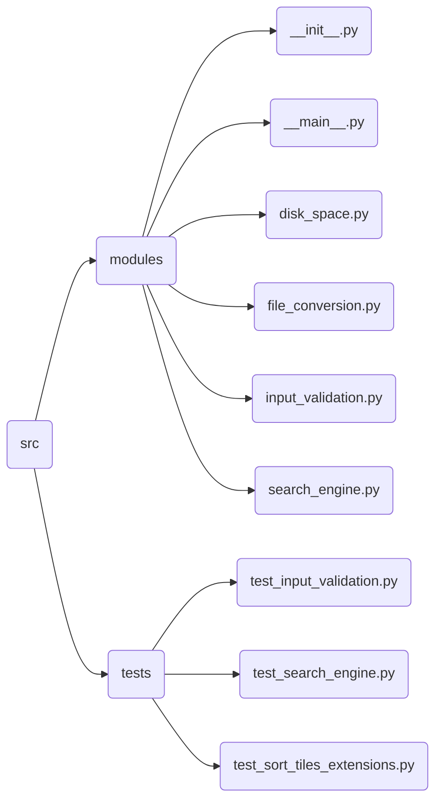

# Welcome to Snake Search Project!
Hi! This project does not carry any payload. Made as the first relatively large independent project, although for the most part it is a set of functions that I implemented earlier, which I put together using a graphical interface.
# What features does this program have?

 - Search files by name
 - Searching for files by their content (next - *Deep Search*)
 - Providing information about the physical storage media on the computer, as well as a convenient presentation of this information in the form of graphs using the *matplotlb library*
 - Several types of file conversion to other formats

## Project structure

* *src\modules* - directory with all the necessary modules for work.
* *src\tests* - directory with tests.

# How to install and run?
*TBA*